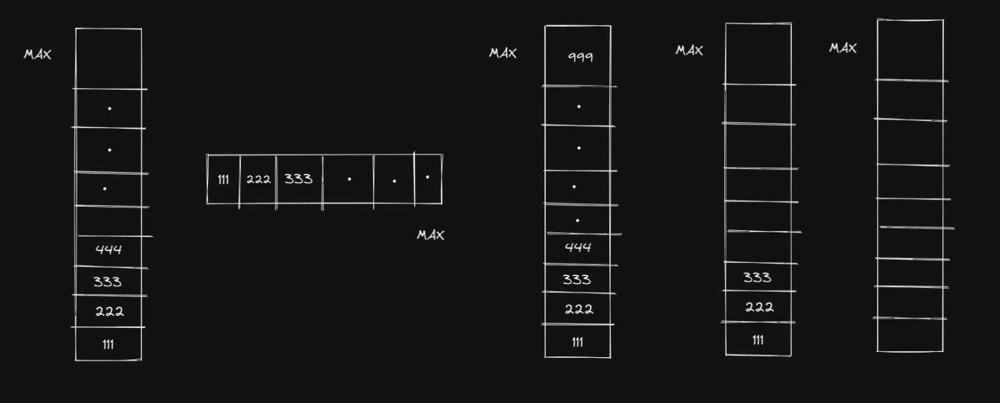

## Represtanciones de Pilas

- Arreglos
- Listas Ligadas

### Representacion de Pilas 
- Poner un elemento (Push)
- Quitar un elemento (Pop)
    - Operaciones auxilires
    - Pila-vacia
    - Pila-llena
  
### Pila_vacia (Pila, Tope, Band)
1. Si Tope = 0
   1. Entonces Hacer
   2. Band <-  Verdadero
   3. Sino hacer
   4. Band <-  Falso
2. {Fin de la condicional paso 1}

### Pila_Llena(Pila, Tope, MAX, Band)
1. Si TOPE = MAX
   1. Entonces hacer
   2. Band <-  VERVADERO
   3. Si no hacer
   4. Band <-  Falso
2. {Fin de la condicional paso 1}

### PONE (Pila, MAX, DATO)

1. Llamar a Pila-Llena con Pila, Tope, Max y Band
2. Si Band = Verdadero
   1. Entonces
      1. Escribir "Debordamiento"
   2. Si no
      1. Hacer
      2. Tope <-  Tope + 1
      3. Pila[Tope] <-  Dato
3. {Fin condicional paso 2}

### Quita (Pila, Tope, Dato)
1. Llamar a pila_vacia con Pila, Tope)
2. Si Band <-  Verdadero
    1. Escribir "Sudesbordamiento"
   2. Sino Hacer
      1. Dato <-  Pila [Tope]
      2. Tope <-  Tope-1
3. {Fin de condicionar paso 2}

## Colas

### Insertar Cola(cola,MAX,FRENTE,FINAL, DATO)

1. Si FINAL < MAX
   1. entonces hacer FINAL <-  FINAL + 1
   2. COLA [Final] <-  Dato
2. Si final = 1 entonces
   1. Hace frente <-  1
{Final condicional}
Si_no
   2. Escribir "Desordamiento"
{Fin de la condicional}

Eliminar (COLA, FRENTE, FINAL, DATO)
1. Si FRENTE = 0
   1. Entonces
      1. Hacer Dato <-  COLA [FRENTE]
   2. Si frente = Final
      1. entonces 
         1. Hacer frente = 0
         2. Final <-  0
      2. sino
      3. Hacer FRENTE <-  FRENTE + 1
   3. {Fin condicional}